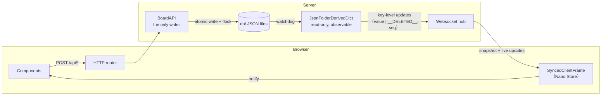

# Dzhira

> This is not Jira. It's **Dzhira**. 🎨🖍️

A parody of Jira's Kanban board — a tiny subset of the real fundamentals, wrapped in a UI that looks
like it was *designed by a 12-year-old in MS Paint* (gloriously goofy, but still readable). Single
user. Zero enterprise. Maximum crayon.

It is also, underneath the crayon, a genuinely-real app: a Nano JSX + bun frontend, a FastAPI
backend, and a folder-of-JSON-files "database" kept live and consistent with `watchdog` + file locks,
streamed to the browser over one websocket via the *derived-dict → frame* pattern (ported and
slimmed down from the [eventCamera](#credits--lineage) project).

---

## Installation

**Prerequisites:** [bun](https://bun.sh) (`curl -fsSL https://bun.sh/install | bash`) and Python 3.11+.

```bash
# 1. Backend deps (a virtualenv keeps them off your system Python)
python3 -m venv venv
./venv/bin/python -m pip install -r requirements.txt

# 2. Run it. This bun-builds the frontend (installing its deps on first run) then serves everything.
./venv/bin/python backend/main.py               # -> http://127.0.0.1:8000
```

Open **http://127.0.0.1:8000** and you'll land on a starter board (three columns, a few sample tasks).
Everything lives in a `db/` folder of JSON files created next to the repo — delete it to start fresh.

Useful flags:

| Flag | Default | Meaning |
| --- | --- | --- |
| `--host` | `127.0.0.1` | Interface to bind (`0.0.0.0` to expose on your network). |
| `--port` | `8000` | Port to serve on. |
| `--db-folder DIR` | `./db` | Where the JSON DB lives (created + seeded on first run). |
| `--skip-frontend-build` | off | Serve the existing `frontend/dist` without rebuilding (faster restarts). |

Run the backend test suite with `./venv/bin/python -m pytest`.

---

## User Guide

Everything in Dzhira is live: any change you make (or that a second browser tab makes, or that you make
by hand-editing a JSON file in `db/`) shows up everywhere instantly. There is no "save the board" — it
saves itself.

**The board.** Columns run left to right; task cards stack inside them, top to bottom, in an order you
control.

**Make a task.** Click **＋ New task** in the topbar. Give it a title, an optional description, pick its
**project** (that forms its `#PROJ-NNN` id), and toggle any **tags**. Hit **Create** — it appears at the
top of the leftmost column.

**Edit a task.** *Click* a card (a click, not a drag) to reopen the same editor. The id and project are
fixed once created; everything else is editable.

**Move & reorder.** *Drag* a card to reorder it within a column or move it to another. A dotted **ghost
slot** shows exactly where it'll land — let go to drop it there.

**Delete a task.** Hover a card and click its 🗑️ (or use **Delete** inside the editor). Both ask
"are you sure?" first.

**Columns.** Click a column's name (or its ✎) to rename it; the `←` / `→` arrows swap it with its
neighbor; 🗑️ deletes it (its tasks move to the nearest column). Scroll right and hit the dashed
**＋ column** to add one. A board always keeps at least one column.

**Tags.** Topbar **🏷️ Tags**: each tag is a name + color. Add, rename/recolor, or delete them. Deleting
a tag just removes it from every task that had it.

**Projects.** Topbar **📁 Projects**: a project is a 3-letter code (like `ENG`). Add, rename, or delete
them. ⚠️ **Deleting a project deletes all of its tasks** — the task id is hard-tied to the code.

**Assignee.** Topbar shows the single user (Dzhira is single-user). Click it to set your **name** and
your **circle color**; the initial is drawn black or white for contrast. Every task is automatically
assigned to you.

---

## Specification & Developer Documentation

This section began life as a loose spec and grows into developer documentation as the code lands —
each part points at the files that implement it. It has two halves: **[what Dzhira does](#1-what-dzhira-does-the-feature-spec)**
(the product) and **[how it's built](#2-how-its-built-architecture)** (the engineering).

### 1. What Dzhira does (the feature spec)

#### 1.1 The board

The app opens onto a **Kanban board**: a horizontal row of **status columns**. Tasks live as boxes
inside their column, stacked in an order you control.

- Columns can be **created, renamed, deleted, and reordered**. To add one, scroll to the rightmost
  column — a `+` appears past it. To reorder, use the subtle `←` / `→` arrows by a column's name,
  which swap it with its left/right neighbor.
- A board must always have **at least one column**. Deleting the last one is refused.

#### 1.2 Tasks & cards

Each task is a card showing:

- a **bold title** on top;
- a **description preview**, truncated with `…` when long;
- its **tags** as colored chips;
- its **`#PROJ-NNN` identifier** in a corner (e.g. `#ENG-222`);
- an **assignee circle** — the assignee's first initial centered in a colored disc (the letter is
  black or white, whichever contrasts better with the disc color);
- a small **trash icon** to delete it.

A task's fields: title, description, tags, a unique project-scoped id, and an assignee. Since Dzhira
is **single-user**, the assignee is the same one person on every task (see [§1.4](#14-the-topbar--its-popouts)).

#### 1.3 Drag & drop

Drag a card to **reorder it within a column** or **move it to another column**. As you drag, a
**ghost placeholder** (a dotted outline) slots into the exact spot the card would land if you let go
right now — so you always see the result before committing.

#### 1.4 The topbar & its popouts

The topbar holds buttons that open small popout windows for editing each kind of thing:

- **`+` (New task)** — opens the task editor to enter a new task's details. Clicking an existing card
  (a click, not a drag) opens the *same* editor to edit it. Deleting — from the card's trash icon or
  the editor's — shows the *same* "are you sure?" confirmation.
- **Tags** — a list of tags, each a name + color. Create, edit, and delete them.
- **Projects** — a list of **3-letter project codes**. Create, edit, and delete by entering a code.
  (It's a parody; that's all a project is.)
- **Assignee** — configure the single user: their **name** and their **circle color**. Every task is
  automatically assigned to them; it isn't per-task customizable.

#### 1.5 Delete rules

Deletion is destructive, so every delete shows a **warning modal** first. What happens on confirm
depends on *what* is deleted — there are three specific rules:

| Deleting a… | …does this |
| --- | --- |
| **Status column** | Its tasks are **reassigned** to the nearest remaining column. |
| **Project** | **All of its tasks are deleted too** — the task id is hard-tied to the project code. |
| **Tag** | It is simply **removed from every task** that had it. |

The assignee cannot be deleted (there's only one, and every task needs it).

---

### 2. How it's built (architecture)

#### 2.1 The one big idea

**Writes and reads are completely separate paths, and the read path is the only source of truth.**

Nothing is ever optimistically updated in the browser. A write is a plain HTTP `POST` that returns a
bare `{"ok": true}`. The *effect* of that write reaches the UI only by flowing back through the read
path: the write changed a file on disk → a `watchdog` observer notices → a **derived dict** re-reads
and publishes exactly which keys changed → the change is pushed over a **websocket** → a frontend
**frame** applies it → subscribed components re-render.



The payoff: the browser can *never* drift from disk, multiple tabs stay in sync for free, and even a
hand-edit of a JSON file (or a `git pull`) shows up live. This whole pattern is ported and simplified
from the eventCamera project (see [Credits & lineage](#credits--lineage)).

#### 2.2 The stack

- **Frontend:** Nano JSX + TypeScript, bundled by **bun** (`bun run build` → `frontend/dist/`). *(Lands in the frontend checkpoint.)*
- **Backend:** Python + **FastAPI** on uvicorn.
- **Persistence:** a **folder of JSON files** — no database. Consistency via `watchdog`, `flock`, and
  atomic temp-file-then-rename writes.

#### 2.3 Persistence — the JSON DB folder

The DB is one folder, one subfolder per entity type, one file per entity. Implemented in
[`backend/db/layout.py`](backend/db/layout.py) (paths + first-run seeding).

```
db/
  meta/assignee.json          {name, color}                          # the single user
  projects/<CODE>.json        {code, next_num}                       # 3-letter code + id counter
  tags/<tag_id>.json          {id, name, color}
  columns/<col_id>.json       {id, name, order}                      # a Kanban status column
  tasks/<CODE>-<n>.json       {id, title, description,
                               tags:[tag_id...], status:col_id, order}
```

- **Ids as filenames.** Column/tag ids are opaque generated hex (`col_1a2b3c4d`) so they're stable
  across renames; project codes and task ids are validated strictly (they're also the traversal
  guard — see [`backend/db/ids.py`](backend/db/ids.py)).
- **Ordering — the fractional model.** `order` is a float. The board is a *pure projection*: group
  tasks by `status`, sort by `order`. So a drag/reorder rewrites **exactly one** task file (its new
  `status` + `order`). New siblings are spaced `ORDER_STEP` (1000) apart; a move computes the
  fractional midpoint of its neighbors, and a lane is only fully re-spaced ("rebalanced") on the rare
  event that a midpoint gap collapses. Columns are ordered the same way.
- **First-run seeding** is idempotent: `ensure_scaffold` makes the subfolders and, only when the
  board is empty, seeds a friendly starter board (three columns, three tags, a `DZH` project, and a
  few sample tasks) so the first launch isn't a blank page.

#### 2.4 The derived-dict library (read side)

A **derived dict** is a read-only, observable dictionary that is a pure function of some external
state — here, the DB folder. Ported from eventCamera and living in
[`backend/derived/`](backend/derived/):

- [`key_paths.py`](backend/derived/key_paths.py) — the shared path grammar (`"/"` separates dict
  keys, `"[i]"` addresses list elements, `""` = whole tree) plus `get`/`set`/`delete`/`diff_trees`
  tree helpers. Mirrored verbatim on the frontend.
- [`pub_sub_derived_dict.py`](backend/derived/pub_sub_derived_dict.py) — `APubSubDerivedDict`, the
  core: an atomic `read`/`snapshot`/`subscribe` surface delivering `(key_path, value, seq)` updates.
  One state lock guards the tree + seq + subscription table; callbacks fire *outside* the lock via a
  FIFO drain, seq-filtered and in order, with ancestor-changes projected down to each subscriber's
  root. Deep-copies out, so a subscriber can never mutate internal state.
- [`json_folder_derived_dict.py`](backend/derived/json_folder_derived_dict.py) —
  `JsonFolderDerivedDict`, the concrete flavor: a `watchdog` observer mirrors the DB folder into an
  in-memory tree; on any file change it re-reads, **diffs old-vs-new to the key level**, and
  publishes each changed path (or `__DELETED__`). A torn mid-write read (unparseable JSON) is
  *skipped*, never poisoning the mirror — safe because writers rename atomically. It also does **not
  trust the watchdog event _type_** — it reconciles the named path against disk truth (existing
  `.json` → re-read, gone → drop). This is what makes an atomic `os.replace` *over an existing file*
  robust: on macOS FSEvents that fires a spurious `deleted` for a path that is actually still there,
  and trusting it would silently vanish the entry.

#### 2.5 The write side — `BoardAPI` + HTTP

- [`backend/db/board_api.py`](backend/db/board_api.py) — `BoardAPI`, the **only writer**. Every op
  returns `None` (or a new id) and raises `ValueError` on bad input; success produces no client
  payload by design. Single-file edits take a brief `flock` on just that file, then write atomically
  (temp + rename). Cross-file operations (a cascade delete, a lane rebalance) are a *sequence* of
  atomic single-file ops — fine for a single-user board, which simply converges as each change
  streams out. This is also where the three [delete rules](#15-delete-rules) live.
- [`backend/web/http_routers.py`](backend/web/http_routers.py) — thin `POST` endpoints under `/api/*`
  wrapping each `BoardAPI` method, returning `{"ok": true}` or a `400` with the error message.

#### 2.6 Transport — the websocket hub

- [`backend/web/websocket_hub.py`](backend/web/websocket_hub.py) — one shared, multiplexed socket per
  client. A client sends `{op:"subscribe", sub_id, derived_dict, key_path}`; the hub replies with a
  `subscribed` snapshot then forwards live `update` frames verbatim (the derived dict already
  stamped seq + ordered them). Callbacks fire on the watchdog thread and hop onto the asyncio loop
  via a per-connection queue.
- [`backend/web/registry.py`](backend/web/registry.py) — maps wire-constant names to live derived
  dicts. Dzhira exposes exactly one, `DB` (the whole folder), but the registry keeps adding another
  read surface a one-liner.

#### 2.7 Composition root & lifecycle

- [`backend/app.py`](backend/app.py) — `create_app`, the one place instances are built and wired
  (scaffold DB → derived dict → `BoardAPI` → registry → transport → static frontend last, so `/ws`
  and `/api/*` win the route match). The watchdog observer starts/stops in the FastAPI lifespan.
- [`backend/main.py`](backend/main.py) — the launcher: builds the bun frontend (install + build),
  then serves `create_app` on uvicorn with `--host` / `--port` / `--db-folder`.

#### 2.8 Frontend — frames & the goofy board

Nano JSX + TypeScript, bundled by bun ([`frontend/build.ts`](frontend/build.ts): `Bun.build` →
`dist/client.js`, an SCSS-collector plugin → `dist/styles.css`, `index.html` copied in). The read side
mirrors the backend's derived-dict pattern:

- **Frames** ([`frontend/src/frames/`](frontend/src/frames/)) wrap a Nano JSX `Store` and add
  key-path-granular subscriptions. `SyncedClientFrame` is a read-only live mirror of a backend derived
  dict over the socket (seq-filtered, re-root-on-update, reconnect-safe); `LocalClientFrame` holds
  frontend-only shared state. The singletons live in
  [`shared_frames.ts`](frontend/src/frames/shared_frames.ts): `dbFrame` mirrors the whole `DB`;
  `uiFrame` tracks which popout/confirm is open; `dragFrame` is reserved for drag state.
- **`bindFrames`** ([`bind_frames.ts`](frontend/src/frames/bind_frames.ts)) — Nano doesn't auto-render
  on state change, so a component calls this in its constructor to re-`update()` on frame changes and
  clean up on unmount.
- **The socket** ([`ws/socket.ts`](frontend/src/ws/socket.ts)) — one reconnecting, multiplexed
  `WebSocket`; re-subscribes and buffers-then-replays updates across reconnects.
- **`api.ts`** ([`frontend/src/api.ts`](frontend/src/api.ts)) — the POST write client; every call
  resolves to `null` (ok) or an error string. No optimistic updates: the UI changes only when the
  resulting derived-dict update streams back.
- **`model.ts`** ([`frontend/src/model.ts`](frontend/src/model.ts)) — typed views over `dbFrame`
  (columns/tasks sorted by `order`, tag & project lookups, the contrast-ink helper for circles/chips).

Components ([`frontend/src/components/`](frontend/src/components/)): `Topbar`, `Board` (columns +
inline rename / reorder / delete controls), `TaskCard`, `Popups` (the popout host), `TaskEditor`,
and the `managers.tsx` trio (Tags / Projects / Assignee). Editors keep their draft in instance state
and mutate it on `onInput` *without* re-rendering, so typing never drops focus (Nano recreates DOM on
`update()`).

**Drag & drop** ([`drag_controller.ts`](frontend/src/drag_controller.ts)) is deliberately *outside*
the Nano render cycle: it works off DOM `data-` attributes, floats a copy of the card under the
cursor, and moves a dotted `.ghost-slot` to the computed insertion point. On drop it commits once via
`taskApi.move(taskId, statusId, index)` and lets the resulting websocket update re-render the board —
so a drag stays smooth (no per-`pointermove` re-render) and never optimistically lies about the result.

#### 2.9 Code map

```
backend/
  main.py              launcher (bun build + uvicorn; --host/--port/--db-folder)
  app.py               create_app composition root + lifespan
  derived/             the read side (ported derived-dict library)
    key_paths.py         path grammar + tree helpers
    pub_sub_derived_dict.py   APubSubDerivedDict core (subscribe/publish/seq)
    json_folder_derived_dict.py   watchdog folder mirror + JSON parse
    node_types.py
  db/                  the data model + the only writer
    layout.py            folder layout, ORDER_STEP, first-run seeding
    ids.py               id/code validation + generation (also the traversal guard)
    board_api.py         BoardAPI — writes, fractional reorder, delete cascades
  web/                 transport
    registry.py          wire-name -> derived-dict map
    websocket_hub.py     multiplexed subscribe/snapshot/update socket
    http_routers.py      /api/* POST write endpoints
  util/logs.py         warn() shim
tests/                 pytest smoke tests (key paths, folder mirror, BoardAPI, boot)
frontend/
  build.ts             bun bundler + SCSS collector + index.html copy
  index.html           the shell (loads /client.js + /styles.css)
  src/
    client.tsx           entry: open socket, wire dbFrame, install drag, render <App/>
    key_paths.ts         path grammar + tree helpers (mirror of the Python side)
    derived_dicts.ts     the DB wire constant
    ws/socket.ts         one reconnecting multiplexed websocket
    frames/              a_client_frame, synced/local frames, bind_frames, shared_frames
    api.ts               POST write client (bare ack / error string)
    model.ts             typed views over dbFrame (+ contrast-ink, initials)
    ui.ts                open/close popouts + confirm helpers
    drag_controller.ts   pointer drag & drop with the ghost slot
    components/          Topbar, Board, TaskCard, Popups, TaskEditor, managers, shared_widgets
    styles.scss          the MS-Paint stylesheet
```

---

## Credits & lineage

The read-path architecture (derived dicts, the websocket hub, the frontend frames) is ported and
deliberately *slimmed down* from the author's **eventCamera** project, which pioneered the
"derived dictionaries as read-only backend state, streamed to Nano JSX frames" pattern. The frontend
build setup follows the same author's **SadkoTrans** admin dashboard. Dzhira keeps the good bones and
throws away everything it doesn't need — then paints the result in crayon.
